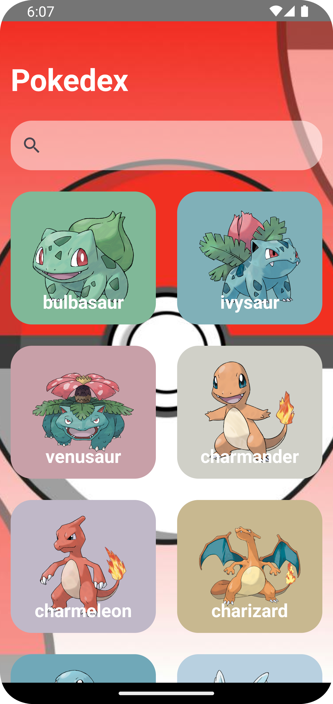
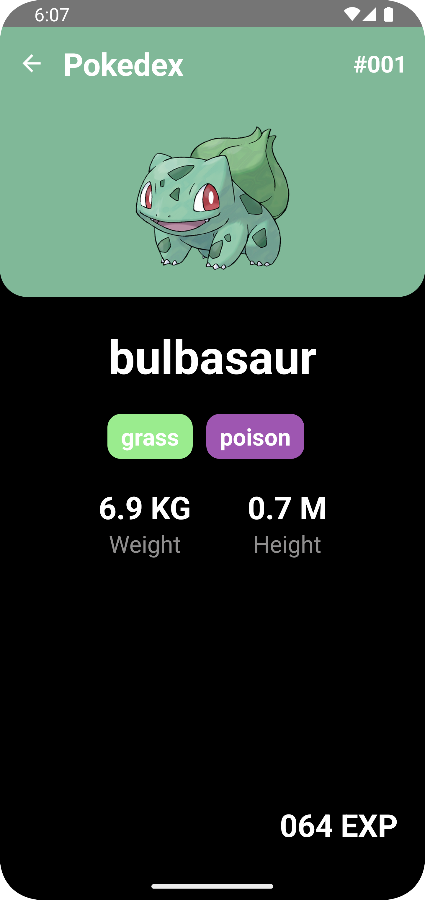

# Orbit-MVI-Compose-Pokedex

|메인|검색|
|:------:|:-----:|
|  |  |

## Tech stack & Open-source libraries
- Minimum SDK level 24
- [Kotlin](https://kotlinlang.org/) based, [Coroutines](https://github.com/Kotlin/kotlinx.coroutines) + [Flow](https://kotlin.github.io/kotlinx.coroutines/kotlinx-coroutines-core/kotlinx.coroutines.flow/) for asynchronous.
- Jetpack
  - Lifecycle: Observe Android lifecycles and handle UI states upon the lifecycle changes.
  - ViewModel: Manages UI-related data holder and lifecycle aware. Allows data to survive configuration changes such as screen rotations.
  - Room: Constructs Database by providing an abstraction layer over SQLite to allow fluent database access.
  - [Hilt](https://dagger.dev/hilt/): for dependency injection.
- Architecture
  - [Orbit](https://github.com/orbit-mvi/orbit-mvi) : MVI Architecture 
  - MVVM Architecture
  - Repository Pattern
- [Retrofit2 & OkHttp3](https://github.com/square/retrofit): Construct the REST APIs and paging network data.
- [Moshi](https://github.com/square/moshi/): A modern JSON library for Kotlin and Java.
- [Coil](https://github.com/coil-kt/coil): Image loading library
